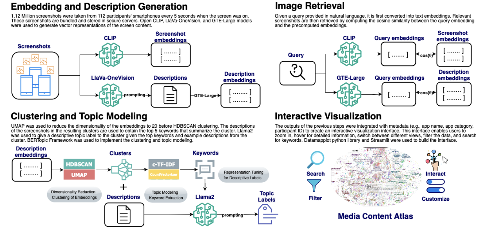

# Media Content Atlas (MCA) 📱🗺️

**A Pipeline to Explore and Investigate Multidimensional Media Space using Multimodal LLMs**

Media Content Atlas (MCA) is a first-of-its-kind pipeline that enables large-scale, AI-driven analysis of digital media experiences using multimodal LLMs. It combines recent advances in machine learning and visualization to support both open-ended and hypothesis-driven research into screen content and behavior.

🔗 **Website & Demo**: [mediacontentatlas.github.io](https://mediacontentatlas.github.io)  
🎥 **Quick Video Explanation**: [Watch on YouTube](https://www.youtube.com/watch?v=UjFk0YzEzqs)  
📎 **Citation**: See [Citation Section](#-citation)

## 🔍 Overview

Built on **1.12 million smartphone screenshots** collected from **112 adults** over a month, MCA enables researchers to:

- Perform **content-based clustering** and **topic modeling** using semantic and visual signals
- Automatically **generate descriptions** of screen content
- **Search and retrieve** content across individuals and moments
- **Visualize digital media behavior** with an interactive dashboard

Expert reviewers rated MCA's clustering results **96% relevant** and AI-generated descriptions **83% accurate**.




## 🗂️ Code Structure

The pipeline is fully modular, with standalone scripts and notebooks for each stage:

### [Quick Start on Google Colab with Free T4](https://colab.research.google.com/drive/1IuiBkc4SBORbbVejKPkFn7Qw2KHHxywv?usp=sharing)

### 📦 `mca_pipeline/` – Core Components

| Stage | Script | Description |
|-------|--------|-------------|
| 🖼️ Embedding | [`anonymized_clip_embedding_generation.py`](mca_pipeline/anonymized_clip_embedding_generation.py) | Generate visual embeddings using CLIP |
| 📝 Captioning | [`anonymized_description_generation.py`](mca_pipeline/anonymized_description_generation.py) | Generate descriptions using LLaVA-OneVision |
| 🔠 Embedding | [`anonymized_description_embedding_generation.py`](mca_pipeline/anonymized_description_embedding_generation.py) | Generate sentence embeddings using GTE-Large |
| 🧵 Clustering | [`anonymized_clustering_topicmodeling_example.py`](mca_pipeline/anonymized_clustering_topicmodeling_example.py) | Cluster and label screenshots using BERTopic + LLaMA2 |
| 📊 Visualization | [`anonymized_create_interactive_visualizations.ipynb`](mca_pipeline/anonymized_create_interactive_visualizations.ipynb) | Create an interactive dashboard using DataMapPlot |
| 🔍 Retrieval | [`anonymized_image_retrieval_app.py`](mca_pipeline/anonymized_image_retrieval_app.py) | Retrieve screenshots using visual or textual similarity |

### 🧪 `expert_surveys/` – Evaluation Instruments

| File | Description |
|------|-------------|
| [`anonymized_survey1.py`](expert_surveys/anonymized_survey1.py) | Survey for cluster label relevance |
| [`anonymized_survey2.py`](expert_surveys/anonymized_survey2.py) | Survey for description accuracy |
| [`anonymized_survey3.py`](expert_surveys/anonymized_survey3.py) | Survey for retrieval performance |


## 🙋‍♀️ Questions or Feedback?

We’d love to hear from you! Feel free to:

- 💬 [Open an issue](https://github.com/mediacontentatlas/mediacontentatlas/issues) for bugs, suggestions, or feature requests  
- 📬 Email us: [mervecer@stanford.edu](mailto:mervecer@stanford.edu)  
- 🌐 Explore the lite demo: [mediacontentatlas.github.io](https://mediacontentatlas.github.io)


## 🛠️ Roadmap

Here’s what’s next for MCA, let us know if you'd like collaborate:

- 🔁 **Reproducibility updates** for easier setup  
- 🧩 **Customization utilities** (label editing, filters, user tagging)
- 📈 **Longitudinal visualizations** to explore media patterns over time
Stay tuned! ⭐ Star this repo to keep up with updates.


## 📚 Citation

If you use MCA in your research, please cite the CHI 2025 paper:

```bibtex
@inproceedings{cerit2025mca,
  author = {Merve Cerit and Eric Zelikman and Mu-Jung Cho and Thomas N. Robinson and Byron Reeves and Nilam Ram and Nick Haber},
  title = {Media Content Atlas: A Pipeline to Explore and Investigate Multidimensional Media Space using Multimodal LLMs},
  booktitle = {Extended Abstracts of the CHI Conference on Human Factors in Computing Systems (CHI EA '25)},
  year = {2025},
  month = {April},
  location = {Yokohama, Japan},
  publisher = {ACM},
  address = {New York, NY, USA},
  pages = {19},
  doi = {10.1145/3706599.3720055}
}
